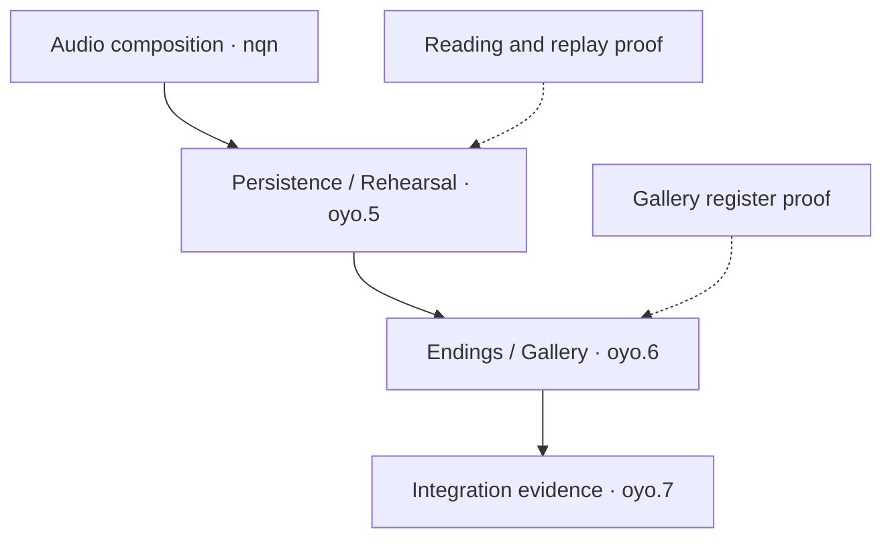

# DWM execution map

Reviewed 1 October 2026 (Hong Kong). This is the single maintained navigation map
for the unfinished work. Beads owns statuses and dependencies; approved design owns
behavior. Update this map when the order or shared ownership changes, rather than
creating another dated backlog. The [handoff](2026-09-23-next-session-handoff.md)
owns the latest tested source and links to detailed evidence.

The inspected export has **23 unfinished records**, including parent aggregates,
overlapping acceptance and deferred work. This records update does not close tasks,
change dependencies or synchronize Dolt. Eight stale task descriptions/titles are
reconciled; 183 other issue records retain their exact bytes.

## Execution rule

Use **one player outcome, one lead Bead, one candidate and one shared proof bundle**.
Companion issues receive links to the exact acceptance clauses that the proof covers.
A shared journey can satisfy several clauses without completing every companion.

Keep one implementation batch touching shared save/narrative owners at a time.
A second implementation may proceed when its files and state owners are independent;
read-only audits and independent reviews can run in parallel. Assign one integrator
for shared files, Git and Beads. More agents should shorten a specific investigation,
not create competing versions of GameState or SaveManager.

## Work queue and overlaps

| Lead / placement | Related records | Smallest useful outcome and proof |
|---|---|---|
| **Next runtime batch: `dwm-634.3`** | `dwm-634` parent; touched `dwm-sx8` mappings only | Decide whether the measured compact validation witness is safe. Compare baseline/witness failures, memo lifetime, ordered storage/restart behavior and modern F5/consent. Keep production unchanged until equivalence passes; retain unfavorable timings. |
| **Next player feature: `dwm-vky.14`** | `dwm-eei.10`, `dwm-eei.11`, Witnessed remainder of `dwm-eei.5` | One Solo Dating session: pre-prose → board → committed result → post-prose → History → Save → fresh Load. Bind one semantic sequence to real owners and route Quick through the same admitted frontier. One connected cloud journey plus refusal/restore checks. |
| **Following reading batch: `dwm-n3h.2`** | `dwm-n3h`, exact Next/replay portion of `dwm-vky.14`, relevant `dwm-oyo.5` clauses | Finish the per-entry authored selector contract and successor reached signature, then exact-variant witnessing/Next/replay. Ordinary phase/reply/line and Alone cause are known gaps; request extra author input only where another independent fact changes presentation. |
| **Independent candidate: `dwm-eei.2`** | Settings/Profile recovery; authored audio preview remains separate | Real indeterminate Profile write → Settings mutation refusal/custody → proven reconciliation. Reuse current Settings hosts and transactions. An audio sample catalogue is not a prerequisite for this recovery test. |
| **Independent candidate: `dwm-7wj`** | Gallery clauses of `dwm-oyo.6` | Replace the dropdown with a visible plural-version register using existing newest-first chronology. Verify exact selection/Retry/focus and no writes during inspection. Authored record cues and native ScrollPattern retain their own acceptance. |
| **Catalogue-dependent: `dwm-nqn`** | Feeds `dwm-oyo.5`; Settings audio-output clauses | Admit an immutable neutral-ID cue/Load-anchor plan, then compose it through current save/restore owners. Pause preserves the physical playhead; Load uses authored anchors. Use fixtures for engineering without inventing production audio. |
| **Remaining UI amendment: `dwm-vky`** | Its remaining Drift and all-input acceptance | Implement only fully specified Drift cards through one deterministic plan/receipt and safe-boundary projection. Tint and Steady Interface already have accepted children. Coordinate schema edits; do not make unrelated UI work wait for Drift. |
| **Rolling companion: `dwm-sx8`** | Every batch that changes a public boundary | Inspect real callers and current authority; retire truly unused superseded APIs, otherwise link meaningful behavior tests. Repair nearby mappings with the feature they describe and regenerate inventories once. Do not run a separate whole-facade rewrite alongside every batch. |
| **Integration/aggregate acceptance** | `dwm-oyo.5`, `dwm-oyo.6`, `dwm-oyo.7`, `dwm-oyo`, `dwm-eei` | Consume the actual component proofs and inspect remaining clauses. Preserve implemented pair-deck/Practice/endings. Use one stable final candidate for the required broad/release matrix; a green focused batch does not close an umbrella. |
| **Explicit later inputs** | `dwm-eob`, `dwm-5ht` | Representative authored translations → adapter choice → bilingual captions/History on the same semantic leaf. Menus stay single-language and speech Primary-only. These remain deferred and do not block English fixture-backed development. |
| **Evidence waiting list** | `dwm-hsi`, `dwm-eei.17`, `dwm-wuk` | Resume on a matching reply-failure diagnostic, matching native shutdown stall, or usable upstream Windows scrolling capability respectively. Keep diagnostic coverage; repeated successful runs alone do not identify a cause. |

All 23 unfinished IDs appear above. A placement in this queue is not a status change.
The historical `.10/.11` records stay as linked acceptance checklists; closing
them merely as duplicates would lose content, reprojection, ending or assistive
requirements. Hospital/ending continuity and exact Next are explicit follow-on
slices, not implicit claims of the first Solo journey.

Solid arrows below are the recorded unfinished blocking chain. Dotted arrows are
proposed shared-proof inputs, not newly added Beads dependencies. Parent-child
and discovered-from links are not automatically prerequisites.



## What to simplify now

- Use the [unshipped-save policy](../design/2026-09-29-unshipped-development-save-policy.md).
  Obsolete Run/Profile migration, legacy caption backfill and mandatory gap UI
  are off the required path. A deliberately incompatible successor gets an
  explicit admission boundary; supported-format correctness remains.
- Reuse existing live captions, the three-caption viewport, Skip/Auto/Load,
  two-device rebinding, canonical frozen-context schemas, chronology, pair-deck
  wiring, tint and Steady Interface. Old descriptions must not recreate them.
- Give the reading group one durable semantic owner. Retained display copies,
  History, Save/Load and Quick consume its data; no second transcript/store.
- Keep one current evidence receipt per accepted batch. Beads, the handoff and
  PR link it instead of repeating its full narrative. Preserve prior receipts
  as historical evidence; do not reseal them to look current.
- Delete runtime code only after caller/current-authority review and a matching
  regression or retirement proof. Remove unused abstractions and superseded
  compatibility paths when that makes the selected implementation smaller.
  A stale test label or an old-looking file is not sufficient deletion evidence.

## A repeatable batch card

Put this short card in the lead Bead or its existing scoped plan; do not create a
new ticket or document for every field.

```text
Outcome: one observable behavior or measured decision
Lead + companions: one owner; exact shared acceptance clauses
Prerequisites: actual missing inputs, with a resume condition
Owned files: shared owners named; independent edits assigned separately
Simplification: code/state/duplicate work removed or deliberately avoided
Proof: exact commands, one connected journey, relevant failure cases
Receipt: tested source/merge + run + raw artifact links
Stop: acceptance passes, or one concrete unresolved choice is identified
```

For the next `dwm-634.3` card, reuse
[test_save_manager_parse_cache.gd](../../tests/unit/test_save_manager_parse_cache.gd),
[test_revision_storage.gd](../../tests/backup_storage/test_revision_storage.gd),
[test_backup_quick_actions.gd](../../tests/unit/test_backup_quick_actions.gd)
and the [manual witness runner](../../tools/testing/Invoke-ManualSaveWitnessPerformance.ps1).
The old `quick_save_latest` path does not exercise the modern backup helper;
include the presentation-port/F5 path. Keep the production test that expects the
helper's full success document until an explicit adoption change; add distinct
diagnostic witness assertions first. A format cutover is unnecessary for this
helper experiment.

## Cloud verification and CI opportunity

Godot and PowerShell execution stays in GitHub cloud. This planning update runs
no engine tests and changes no runtime, test or workflow files.

Run focused suites while changing the candidate. Add suites for the actual changed
owners, not every related issue title. Run the required broad integration gate once
the coherent code batch is stable. Documentation/status-only updates get structural
review and honest source-scoped evidence; they need not restart engine benchmarks.

The UI amendment section 13, item 7 still requires regenerating eight evidence
records once the affected implementation is complete: `tools/desktop_shell`,
`tools/stat_hud`, `tools/title_resume`, `tools/title_shell`,
`tools/backup_ui/evidence/ui`, and the three
`tools/save_load_loop/evidence/{baseline,loop,smoke}` `result.json` records.
Use actual final-candidate runs; copying hashes into old receipts is not acceptance.

| Changed boundary | Initial cloud verification |
|---|---|
| Reading ledger/session | `reading_delivery`; `dating` or `endings` when their adapters change |
| Save admission / Quick | `settings`, `persistence`, `checkpoint_diagnostics`; actual Desktop/Dating adapter coverage when changed |
| Save/schema successor | `new_account`, `persistence`, `settings`, then fresh seven-day recovery |
| Public API / callers | [public-surface gate](../../tools/testing/Invoke-PublicSurfaceValidation.ps1) plus the owning behavior suites |
| Connected presentation | Relevant suites, then rendered desktop/journeys; retain native-platform evidence limits |

In [Run77](https://github.com/Siuuuers/dwm/actions/runs/36525478153), measured from
the first job start to final job completion, the workflow took **43m23s**. Its
seven-day job took **35m28s**. The producer plus existing admission/preparation
comparisons took **10m59s**, followed serially by outgoing **57s**, lazy **3m12s**,
region **7m23s** and warm-proof **11m47s** comparisons.

The first CI improvement should keep that combined producer and fan out its four
independent consumers into separate jobs/checkouts. Their serial sum is 23m19s
versus an 11m47s longest consumer: **11m32s is a theoretical saving before extra
setup, transfer and scheduling overhead**, not an achieved speedup. This is an
independent workflow candidate, not an extra blocker for the runtime queue.

Preserve the existing producer dependencies: outgoing also needs both localized
payloads and their manifest from checkpoint performance; the other consumers
need the exact Day7 results/payload. Retain same-workflow-run identity and the
outgoing manifest's producer-attempt <= consumer-attempt check. Verify checkout
and input hashes, recovered
66-checkpoint identity and required Git history/provenance. Keep each experiment's
baseline/candidate alternation, fresh process roots and cache modes separate.
Do not run comparisons concurrently in one checkout or timing environment:
the [seven-day driver](../../tools/testing/Invoke-SevenDayHistoryPerformance.ps1)
temporarily substitutes SaveManager bytes, and shared CPU/disk/cache contention
would compromise comparison.

Do not remove the four deliberate duplicate diagnostic executions: isolated and
Settings interaction-order coverage serve different checks. More tests or fewer
tests are not the objective; demonstrated behavior and a shorter feedback cycle are.
