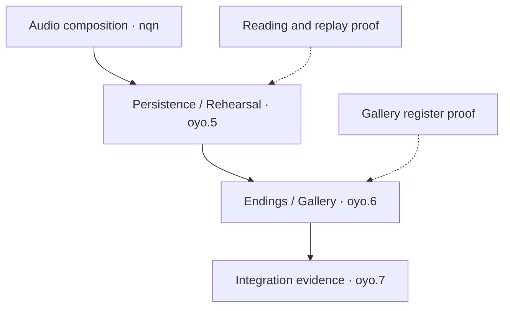

# DWM execution map

Reviewed 1 October 2026 (Hong Kong). This is the single maintained navigation map
for the unfinished work. Beads owns statuses and dependencies; approved design owns
behavior. Update this map when the order or shared ownership changes, rather than
creating another dated backlog. The [handoff](2026-09-23-next-session-handoff.md)
owns the latest tested source and links to detailed evidence.

The inspected export has **23 unfinished records**, including parent aggregates,
overlapping acceptance and deferred work. Queue placement does not close a task,
change its dependencies or claim Dolt synchronization. Implementation status and
cloud acceptance below are separate; the handoff and source-bound receipt own
their exact source, run and count evidence.

## Execution rule

Use **one player outcome, one lead Bead, one candidate and one shared proof bundle**.
Companion issues receive links to the exact acceptance clauses that the proof covers.
A shared journey can satisfy several clauses without completing every companion.

Keep one implementation batch touching shared save/narrative owners at a time.
A second implementation may proceed when its files and state owners are independent;
read-only audits and independent reviews can run in parallel. Assign one integrator
for shared files, Git and Beads. More agents should shorten a specific investigation,
not create competing versions of GameState or SaveManager.

## Work queue and overlaps

| Lead / placement | Related records | Smallest useful outcome and proof |
|---|---|---|
| **Accepted bounded increment; reading remainder: `dwm-vky.14`** | `dwm-eei.10`, `dwm-eei.11`, Witnessed remainder of `dwm-eei.5` | The opt-in fixed Solo session connects pre-prose → board → committed result → post-prose → History → Save → fresh Load through real owners. Quick shares the admitted frontier; one ledger and immutable entry frames survive the board. Final broad Run95 passes 23/23 logical jobs across attempts 1 and 2, with 2,131 GUT executions / 2,127 unique cases, fresh-process History/Save/Load, Settings, rendered UI/audit and the remaining broad gates. Retained failures and retry provenance are in the shared proof. Ordinary Pause Save during partial reveal, production catalogue registration, exact Next, Hospital/ending continuity and native all-input acceptance remain open. |
| **Accepted increment; remaining latency: `dwm-634.3`** | `dwm-634` parent; touched `dwm-sx8` mappings only | Compact per-write validation witnesses and frozen-baseline correctness controls are implemented. Focused production Run81 and broad Run82 passed. Retain this issue for remaining terminal-settlement/checkpoint cost, matched complete-operation measurements and native responsiveness acceptance; one helper improvement does not close the lag task. |
| **Independent CI change: accepted in Run82** | Existing performance and required-check gates | The retained-history producer now feeds four comparison jobs on separate runners/checkouts, with verified source/run/input manifests and an aggregate gate retaining the required-check name. Run82 verifies the actual fanout and all consumer evidence. Observed elapsed time is not a controlled causal speedup measurement. |
| **Following reading batch: `dwm-n3h.2`** | `dwm-n3h`, exact Next/replay portion of `dwm-vky.14`, relevant `dwm-oyo.5` clauses | Finish the per-entry authored selector contract and successor reached signature, then exact-variant witnessing/Next/replay. Ordinary phase/reply/line and Alone cause are known gaps; request extra author input only where another independent fact changes presentation. |
| **Independent candidate: `dwm-eei.2`** | Settings/Profile recovery; authored audio preview remains separate | Real indeterminate Profile write → Settings mutation refusal/custody → proven reconciliation. Reuse current Settings hosts and transactions. An audio sample catalogue is not a prerequisite for this recovery test. |
| **Independent candidate: `dwm-7wj`** | Gallery clauses of `dwm-oyo.6` | Replace the dropdown with a visible plural-version register using existing newest-first chronology. Verify exact selection/Retry/focus and no writes during inspection. Authored record cues and native ScrollPattern retain their own acceptance. |
| **Catalogue-dependent: `dwm-nqn`** | Feeds `dwm-oyo.5`; Settings audio-output clauses | Admit an immutable neutral-ID cue/Load-anchor plan, then compose it through current save/restore owners. Pause preserves the physical playhead; Load uses authored anchors. Use fixtures for engineering without inventing production audio. |
| **Remaining UI amendment: `dwm-vky`** | Its remaining Drift and all-input acceptance | Implement only fully specified Drift cards through one deterministic plan/receipt and safe-boundary projection. Tint and Steady Interface already have accepted children. Coordinate schema edits; do not make unrelated UI work wait for Drift. |
| **Rolling companion: `dwm-sx8`** | Every batch that changes a public boundary | Inspect real callers and current authority; retire truly unused superseded APIs, otherwise link meaningful behavior tests. Repair nearby mappings with the feature they describe and regenerate inventories once. Do not run a separate whole-facade rewrite alongside every batch. |
| **Integration/aggregate acceptance** | `dwm-oyo.5`, `dwm-oyo.6`, `dwm-oyo.7`, `dwm-oyo`, `dwm-eei` | Consume the actual component proofs and inspect remaining clauses. Preserve implemented pair-deck/Practice/endings. Use one stable final candidate for the required broad/release matrix; a green focused batch does not close an umbrella. |
| **Explicit later inputs** | `dwm-eob`, `dwm-5ht` | Representative authored translations → adapter choice → bilingual captions/History on the same semantic leaf. Menus stay single-language and speech Primary-only. These remain deferred and do not block English fixture-backed development. |
| **Evidence waiting list** | `dwm-hsi`, `dwm-eei.17`, `dwm-wuk` | Resume on a matching reply-failure diagnostic, matching native shutdown stall, or usable upstream Windows scrolling capability respectively. Keep diagnostic coverage; repeated successful runs alone do not identify a cause. |

All 23 unfinished IDs appear above. A placement in this queue is not a status change.
The historical `.10/.11` records stay as linked acceptance checklists; closing
them merely as duplicates would lose content, reprojection, ending or assistive
requirements. Hospital/ending continuity and exact Next are explicit follow-on
slices, not implicit claims of the first Solo journey.

Solid arrows below are the recorded unfinished blocking chain. Dotted arrows are
proposed shared-proof inputs, not newly added Beads dependencies. Parent-child
and discovered-from links are not automatically prerequisites.



## What to simplify now

- Use the [unshipped-save policy](../design/2026-09-29-unshipped-development-save-policy.md).
  Obsolete Run/Profile migration, legacy caption backfill and mandatory gap UI
  are off the required path. A deliberately incompatible successor gets an
  explicit admission boundary; supported-format correctness remains.
- Reuse existing live captions, the three-caption viewport, Skip/Auto/Load,
  two-device rebinding, canonical frozen-context schemas, chronology, pair-deck
  wiring, tint and Steady Interface. Old descriptions must not recreate them.
- Give the reading group one durable semantic owner. Retained display copies,
  History, Save/Load and Quick consume its data; no second transcript/store.
- Keep one current evidence receipt per accepted batch. Beads, the handoff and
  PR link it instead of repeating its full narrative. Preserve prior receipts
  as historical evidence; do not reseal them to look current.
- Delete runtime code only after caller/current-authority review and a matching
  regression or retirement proof. Remove unused abstractions and superseded
  compatibility paths when that makes the selected implementation smaller.
  A stale test label or an old-looking file is not sufficient deletion evidence.

## A repeatable batch card

Put this short card in the lead Bead or its existing scoped plan; do not create a
new ticket or document for every field.

```text
Outcome: one observable behavior or measured decision
Lead + companions: one owner; exact shared acceptance clauses
Prerequisites: actual missing inputs, with a resume condition
Owned files: shared owners named; independent edits assigned separately
Simplification: code/state/duplicate work removed or deliberately avoided
Proof: exact commands, one connected journey, relevant failure cases
Receipt: tested source/merge + run + raw artifact links
Stop: acceptance passes, or one concrete unresolved choice is identified
```

The current `dwm-634.3` candidate uses a compact successful admission witness
inside one synchronous Backup write. Its frozen full-result control remains in
[ManualSaveWitnessPort.gd](../../tests/support/ManualSaveWitnessPort.gd); the
candidate delegates to the actual production helper, without another copied
candidate implementation. Every text missing from the per-write memo reaches the full document validator.
The existing exact-text parse cache may reuse parsing; schema validation still runs. The memo ends with that write; physical byte/revision checks,
source binding, journal publication and consumed consent remain required.

The reusable proof is in
[test_save_manager_parse_cache.gd](../../tests/unit/test_save_manager_parse_cache.gd),
[test_manual_witness_revision_storage.gd](../../tests/backup_storage/test_manual_witness_revision_storage.gd),
[test_backup_quick_actions.gd](../../tests/unit/test_backup_quick_actions.gd)
and the [manual witness runner](../../tools/testing/Invoke-ManualSaveWitnessPerformance.ps1).
The modern Quick suite is registered in Settings; old `quick_save_latest` coverage
is not substituted for its presentation-port prepare/commit path. Production focused Run81 and broad Run82 pass; the
[shared receipt](../../evidence/beads_cloud_review/save-witness-production-run78-82.json)
records exact source/merge, all controls and the bounded acceptance. A save-format cutover is unnecessary for this
helper change.

Use the next batch card for the
[durable Solo reading slice](2026-09-29-reading-rail-next-slice.md). Reuse admitted
per-entry frames and one semantic sequence; extend the real Dating, narrative,
Save/restore and presenter owners together. Ownership, History boundaries,
automatic board handoff, save/restore frontier behavior and the unshipped-save
policy are settled. Ask only if a newly identified production wording/staging
selector would change the authored projection contract; fixture-backed
engineering can proceed without another architecture interview.
## Cloud verification and implemented CI change

Godot and PowerShell execution stays in GitHub cloud. The compact witness is
implemented in production and the CI fanout is implemented in the workflow.
Focused production Run81 and broad Run82 passed. The shared receipt separates
earlier diagnostic evidence from actual-production and merge acceptance.

Run focused suites while changing the candidate. Add suites for the actual changed
owners, not every related issue title. Run the required broad integration gate once
the coherent code batch is stable. Documentation/status-only updates get structural
review and honest source-scoped evidence; they need not restart engine benchmarks.

The UI amendment section 13, item 7 still requires regenerating eight evidence
records once the affected implementation is complete: `tools/desktop_shell`,
`tools/stat_hud`, `tools/title_resume`, `tools/title_shell`,
`tools/backup_ui/evidence/ui`, and the three
`tools/save_load_loop/evidence/{baseline,loop,smoke}` `result.json` records.
Use actual final-candidate runs; copying hashes into old receipts is not acceptance.

| Changed boundary | Initial cloud verification |
|---|---|
| Reading ledger/session | `reading_delivery`; `dating` or `endings` when their adapters change |
| Save admission / Quick | `settings`, `persistence`, `checkpoint_diagnostics`; actual Desktop/Dating adapter coverage when changed |
| Save/schema successor | `new_account`, `persistence`, `settings`, then fresh seven-day recovery |
| Public API / callers | [public-surface gate](../../tools/testing/Invoke-PublicSurfaceValidation.ps1) plus the owning behavior suites |
| Connected presentation | Relevant suites, then rendered desktop/journeys; retain native-platform evidence limits |

In [Run77](https://github.com/Siuuuers/dwm/actions/runs/36525478153), measured from
the first job start to final job completion, the workflow took **43m23s**. Its
seven-day job took **35m28s**. The producer plus existing admission/preparation
comparisons took **10m59s**, followed serially by outgoing **57s**, lazy **3m12s**,
region **7m23s** and warm-proof **11m47s** comparisons.

The workflow now keeps that combined producer and fans out its four independent
consumers into separate jobs, runners and checkouts. The original required-check
name is retained by an aggregate gate that requires the producer and every
comparison to succeed. Run82 passed the producer, all four consumers and this
aggregate; every checkout binds the same tested merge and admitted input hashes.

The historical serial sum is 23m19s versus an 11m47s longest consumer:
**11m32s is a theoretical saving before extra setup, transfer and scheduling
overhead**, not an achieved speedup. Record the actual producer, consumer and
end-to-end timings before making a new performance claim.

The consumers verify checkout identity, the same workflow run, an admitted
producer attempt, exact input hashes and recovered 66-checkpoint identity.
Outgoing also downloads both localized payloads and their manifest from checkpoint
performance; the other comparisons consume the exact Day7 results/payload. Keep
required Git history/provenance, each experiment's baseline/candidate alternation,
fresh process roots and separate cache modes. The
[seven-day driver](../../tools/testing/Invoke-SevenDayHistoryPerformance.ps1)
performs temporary SaveManager substitutions; each comparison must continue to
run in its own checkout and timing environment. Parallel jobs do not authorize
concurrent timing probes inside one runner.
Do not remove the four deliberate duplicate diagnostic executions: isolated and
Settings interaction-order coverage serve different checks. More tests or fewer
tests are not the objective; demonstrated behavior and a shorter feedback cycle are.
