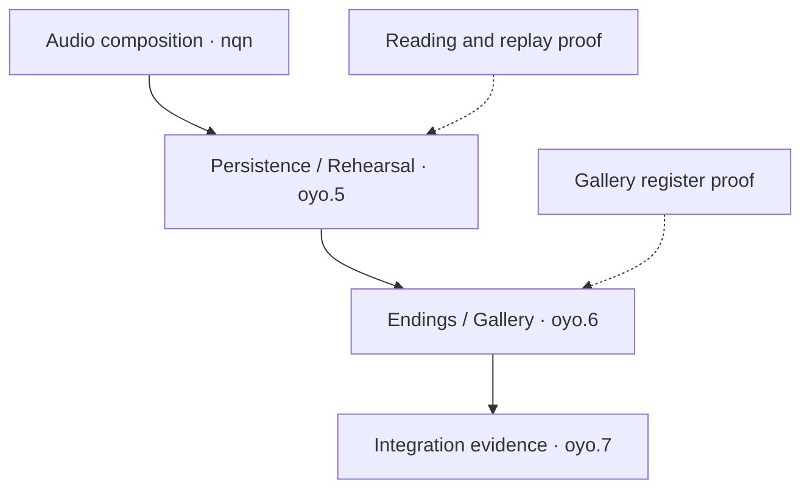

# DWM execution map

Reviewed 3 October 2026 (Hong Kong). This is the single maintained navigation map
for the unfinished work. Beads owns statuses and dependencies; approved design owns
behavior. Update this map when the order or shared ownership changes, rather than
creating another dated backlog. The [handoff](2026-09-23-next-session-handoff.md)
owns the latest tested source and links to detailed evidence.

The inspected export has **23 unfinished records**, including parent aggregates,
overlapping acceptance and deferred work. Queue placement does not close a task,
change its dependencies or claim Dolt synchronization. Implementation status and
cloud acceptance below are separate; the handoff and source-bound receipt own
their exact source, run and count evidence.

## Minimal playable priority — owner correction, 3 October 2026

All fainting uses one Hospital DTL with ordinary dialogue progression, no board
and no separate Continue. Sylvia eligibility remains unchanged. Replace the
no-Sylvia notice path with native playback; the accepted silent timer is not a
required route. Production prose and comprehensive exact authored variants are
deferred; result-based DTL labels use already committed frozen board facts.
Preserve the promised save, recovery, History and physical-completion owners.
The accepted cloud result is below; no parent Bead closes on this bounded increment.

## Owner correction — Hospital manual Save/Load, 3 October 2026

The accepted bounded change under `dwm-vky.14` disables Hospital manual Save/Load,
including Quick shortcuts and Pause/Settings routes, through the existing command
owners. This supersedes the prior next milestone of production Hospital caption
registration for manual saving. Preserve ordinary captions, independent History,
existing save integrity and internal completion/recovery. Global autosave timing
remains unchanged. See the [scoped design correction](../design/2026-08-22-hospital-ordered-ending-current-v1-ui-disposition.md#owner-correction--3-october-2026-hospital-manual-saveload).
Implementation/cloud acceptance of this restriction is recorded below. Historical receipts
below remain historical; test-only Hospital saved fixtures may retain restore and
forgery regression coverage without implying a player Save/Load capability.

## Current bounded checkpoint

**Accepted bounded ordered-ending History and exact Save/Load.** The existing
ledger spans two physical fixture steps; second-caption Save/fresh Load restores
exact History silently without repeating the first consequence. Live History
retires after committed Menu publication; its durable anchor remains intact.
The [current handoff](2026-09-23-next-session-handoff.md#current-acceptance) and
[ending reading receipt](../../evidence/phase_2r/ending_reading_2026_10_03/receipt.json)
own exact source, cloud results and limits.

Next: retain up to two prior visible caption leaves continuously through actual
ending handoff frames, using the existing layer and ledger. Auto continuity and
full native input/accessibility acceptance remain separate. Production catalogue
registration remains disabled; authored prose/variants remain deferred. Hospital
manual Save/Load remains disabled. All 23 unfinished statuses/dependencies stay
unchanged; no live Dolt synchronization. PR stays draft/unmerged.

## Prior Hospital manual policy checkpoint

**Accepted Hospital manual Save/Load restriction.** Source
`82dc881e77f21c34f152d940d55cf317ba5bd784`; actual PR test merge
`0ba41f19f9fed4c2a608d6c329ad3cc07b4d378e`. [Cloud run 37117747147](https://github.com/Siuuuers/dwm/actions/runs/37117747147)
passes 25/25 jobs, with 2,575 primary cases across 13 ordinary/public XML reports
and zero failures, errors or skips. Focused run 37117263065 separately passed
4/4 jobs and 858 primary cases. The [Hospital policy receipt](../../evidence/phase_2r/hospital_manual_policy_2026_10_03/receipt.json)
retains exact sources, diagnostics, artifact hashes and acceptance limits.

The existing Pause command owner disables Hospital rail/Backup Save and Load,
including F5/F9 under Pause and Settings. Both rendered Sylvia variants preserve
the partial caption and save bytes when commands are refused; History remains
independent. Test-only saved fixtures retain restore and forgery coverage without
a player Hospital save path. Existing global autosave timing, save integrity and
internal completion/recovery remain unchanged. No new persistence framework.

The prior Hospital manual-save registration milestone is superseded. Production
History/catalogue and broader reading/ordered-ending work remain separate;
Hospital Next stays disabled. All 23 unfinished Beads retain status/dependencies;
no live Dolt query or synchronization. PR #1 remains draft/unmerged and master
`6a5ddf1564870b43aa9140cad7e0e5b12e43f399` is unchanged. The records-only
descendant is not separately engine-tested.

## Prior shared-fainting checkpoint

**Accepted shared fainting and minimal result routing.** Source `3710d3a20cfd53f9aebf23524fd6f28b6d69e3dd`;
actual PR test merge `50088e6b54ba43f08012e887922d4a912fd11e89`, with master
`6a5ddf1564870b43aa9140cad7e0e5b12e43f399` unchanged.
[Cloud run 37111087986](https://github.com/Siuuuers/dwm/actions/runs/37111087986)
passes 25/25 jobs. The 13 primary ordinary/public XML reports contain 2,575
executions with zero failures, errors or skips; intentional storage-refusal
controls are counted separately. The [shared-fainting receipt](../../evidence/phase_2r/fainting_minimal_2026_10_03/receipt.json)
owns exact artifacts, diagnostic attempts and limits.

All fainting uses the shared Hospital DTL and ordinary caption input. Both Sylvia
variants pass saved-reading fixture journeys; the actual condition-faint route
passes captions, injected completion failure, physical Retry and one next-day
recovery. All 16 post-challenge DTLs dispatch committed frozen result labels;
Practice retains private empty-branch handling. Same-timeline native Return no
longer replaces the admitted playback generation.

Production semantic registration remains disabled; condition-triggered
exact-caption saving and ordered-ending continuity remain unfinished. Hospital
Next remains disabled. All 23 unfinished Beads retain statuses/dependencies;
no live Dolt synchronization is claimed. PR #1 stays draft/unmerged. This
records-only descendant is not separately engine-tested.

## Execution rule

Use **one player outcome, one lead Bead, one candidate and one shared proof bundle**.
Companion issues receive links to the exact acceptance clauses that the proof covers.
A shared journey can satisfy several clauses without completing every companion.

Keep one implementation batch touching shared save/narrative owners at a time.
A second implementation may proceed when its files and state owners are independent;
read-only audits and independent reviews can run in parallel. Assign one integrator
for shared files, Git and Beads. More agents should shorten a specific investigation,
not create competing versions of GameState or SaveManager.

## Work queue and overlaps

| Lead / placement | Related records | Smallest useful outcome and proof |
|---|---|---|
| **Accepted bounded increment; reading remainder: `dwm-vky.14`** | `dwm-eei.10`, `dwm-eei.11`, Witnessed remainder of `dwm-eei.5` | The fixed noncanonical Solo session retains its real pre/board/post, History, Save/Quick and fresh Load foundation. One-shot Next now consumes exact Profile witnessing and the pre-publication baseline: it completes an unseen partial current caption and stops, or silently crosses witnessed variants to the first unseen caption or existing completion boundary. Auto Off commits first; source and destination commit through the existing autosave/journal owner before native motion. The terminal operation and ordered History survive the actual challenge autosave and fresh Load. Finite catalogue-v2 selector admission now joins publication, History, Next and reconstruction through the same ledger, with stable common-caption identity and no causal-ID variants. The separate v2 physical writer/reader now proves the observed sweet/exploded result, actual terminal attitude, exact frames/History/Next/witnesses and unchanged Quick/Profile bytes after fresh Load without speech replay. Both Next Autosave endpoints are retained; the final Quick is the cold-load subject. Run122 acceptance and limits are in the [physical selector receipt](../../evidence/phase_2r/physical_authored_selector_2026_10_02/receipt.json) and [handoff](2026-09-23-next-session-handoff.md). The original eight-mode v1 journey and historical Run120 scope remain preserved. The [layout diagnostic](../../evidence/phase_2r/challenge_layout_2026_10_02/receipt.json) corrects the earlier clipping claim: original Run122 and Run124/125 restored PNGs are byte-identical and show the complete title; no production layout fix was made. Paused Settings F5 is accepted at source `16484fe4eaecf3c49fe2fbb0f46a543a493b57bf` / tested merge `885daae62be2ecdfd8f601cd1c6028eeb12c5243` / Run128; the [shared receipt](../../evidence/phase_2r/paused_settings_quick_2026_10_02/receipt.json) binds current-reveal-only Quick Save, retained Settings/focus/canonical source and silent fresh Load. Paused Settings F9 is accepted through the [shared F9 receipt](../../evidence/phase_2r/paused_settings_load_2026_10_02/receipt.json); Cancel preserves literal source/Settings origin, Confirm restores the earlier point with required durable bookkeeping and native reveal-wait cleanup. Source9/Broad2 now accepts the bounded Sylvia-present Day-3 Schedule-Done Hospital seam through the [Hospital receipt](../../evidence/phase_2r/hospital_reading_2026_10_02/receipt.json). The [captionless native hold receipt](../../evidence/phase_2r/timed_hold_2026_10_03/receipt.json) now accepts its Pause/cancellation prerequisite. Shared Hospital dialogue and both Sylvia variants are accepted in the [shared-fainting receipt](../../evidence/phase_2r/fainting_minimal_2026_10_03/receipt.json). Hospital manual Save/Load restriction is accepted in the [policy receipt](../../evidence/phase_2r/hospital_manual_policy_2026_10_03/receipt.json); the prior manual-save registration milestone is superseded. The bounded ordered-ending History/second-step Save/Load increment is now accepted in the [ending reading receipt](../../evidence/phase_2r/ending_reading_2026_10_03/receipt.json). Next: remaining visible-caption continuity across ending boundaries. Production registration remains disabled. Exact current text and History do not imply pixel-identical transient scrollback or final polish. Production registration/exact replay, remaining Hospital/ordered-ending continuity and native all-input/accessibility acceptance remain separate. |
| **Accepted increment; remaining latency: `dwm-634.3`** | `dwm-634` parent; touched `dwm-sx8` mappings only | Compact per-write validation witnesses and frozen-baseline correctness controls are implemented. Focused production Run81 and broad Run82 passed. Retain this issue for remaining terminal-settlement/checkpoint cost, matched complete-operation measurements and native responsiveness acceptance; one helper improvement does not close the lag task. |
| **Independent CI change: accepted in Run82** | Existing performance and required-check gates | The retained-history producer now feeds four comparison jobs on separate runners/checkouts, with verified source/run/input manifests and an aggregate gate retaining the required-check name. Run82 verifies the actual fanout and all consumer evidence. Observed elapsed time is not a controlled causal speedup measurement. |
| **Following reading batch: `dwm-n3h.2`** | `dwm-n3h`, exact Next/replay portion of `dwm-vky.14`, relevant `dwm-oyo.5` clauses | Finite per-entry authored selector admission and the bounded physical v2 Save/Load proof are accepted for noncanonical Solo pre/post fixtures; physical coverage is one observed sweet/exploded outcome. The global reached-signature successor and production exact-variant coverage/Next/replay remain open. The fixed-fixture Profile witness prerequisite is implemented separately. Ordinary phase/reply/line and Alone cause are known gaps; request extra author input only where another independent fact changes presentation. |
| **Independent candidate: `dwm-eei.2`** | Settings/Profile recovery; authored audio preview remains separate | Real indeterminate Profile write → Settings mutation refusal/custody → proven reconciliation. Reuse current Settings hosts and transactions. An audio sample catalogue is not a prerequisite for this recovery test. |
| **Independent candidate: `dwm-7wj`** | Gallery clauses of `dwm-oyo.6` | Replace the dropdown with a visible plural-version register using existing newest-first chronology. Verify exact selection/Retry/focus and no writes during inspection. Authored record cues and native ScrollPattern retain their own acceptance. |
| **Catalogue-dependent: `dwm-nqn`** | Feeds `dwm-oyo.5`; Settings audio-output clauses | Admit an immutable neutral-ID cue/Load-anchor plan, then compose it through current save/restore owners. Pause preserves the physical playhead; Load uses authored anchors. Use fixtures for engineering without inventing production audio. |
| **Remaining UI amendment: `dwm-vky`** | Its remaining Drift and all-input acceptance | Implement only fully specified Drift cards through one deterministic plan/receipt and safe-boundary projection. Tint and Steady Interface already have accepted children. Coordinate schema edits; do not make unrelated UI work wait for Drift. |
| **Rolling companion: `dwm-sx8`** | Every batch that changes a public boundary | Inspect real callers and current authority; retire truly unused superseded APIs, otherwise link meaningful behavior tests. Repair nearby mappings with the feature they describe and regenerate inventories once. Do not run a separate whole-facade rewrite alongside every batch. |
| **Integration/aggregate acceptance** | `dwm-oyo.5`, `dwm-oyo.6`, `dwm-oyo.7`, `dwm-oyo`, `dwm-eei` | Consume the actual component proofs and inspect remaining clauses. Preserve implemented pair-deck/Practice/endings. Use one stable final candidate for the required broad/release matrix; a green focused batch does not close an umbrella. |
| **Explicit later inputs** | `dwm-eob`, `dwm-5ht` | Representative authored translations → adapter choice → bilingual captions/History on the same semantic leaf. Menus stay single-language and speech Primary-only. These remain deferred and do not block English fixture-backed development. |
| **Evidence waiting list** | `dwm-hsi`, `dwm-eei.17`, `dwm-wuk` | Resume on a matching reply-failure diagnostic, matching native shutdown stall, or usable upstream Windows scrolling capability respectively. Keep diagnostic coverage; repeated successful runs alone do not identify a cause. |

All 23 unfinished IDs appear above. A placement in this queue is not a status change.
The historical `.10/.11` records stay as linked acceptance checklists; closing
them merely as duplicates would lose content, reprojection, ending or assistive
requirements. Fixed-fixture Solo Next and Sylvia-present Hospital retain their bounded receipts;
remaining Hospital/ordered-ending continuity and production exact Next/replay
remain separate acceptance work.

Solid arrows below are the recorded unfinished blocking chain. Dotted arrows are
proposed shared-proof inputs, not newly added Beads dependencies. Parent-child
and discovered-from links are not automatically prerequisites.



## What to simplify now

- Use the [unshipped-save policy](../design/2026-09-29-unshipped-development-save-policy.md).
  Obsolete Run/Profile migration, legacy caption backfill and mandatory gap UI
  are off the required path. A deliberately incompatible successor gets an
  explicit admission boundary; supported-format correctness remains.
- Reuse existing live captions, the three-caption viewport, Skip/Auto/Load,
  two-device rebinding, canonical frozen-context schemas, chronology, pair-deck
  wiring, tint and Steady Interface. Old descriptions must not recreate them.
- Give the reading group one durable semantic owner. Retained display copies,
  History, Save/Load and Quick consume its data; no second transcript/store.
- Keep one current evidence receipt per accepted batch. Beads, the handoff and
  PR link it instead of repeating its full narrative. Preserve prior receipts
  as historical evidence; do not reseal them to look current.
- Delete runtime code only after caller/current-authority review and a matching
  regression or retirement proof. Remove unused abstractions and superseded
  compatibility paths when that makes the selected implementation smaller.
  A stale test label or an old-looking file is not sufficient deletion evidence.

## A repeatable batch card

Put this short card in the lead Bead or its existing scoped plan; do not create a
new ticket or document for every field.

```text
Outcome: one observable behavior or measured decision
Lead + companions: one owner; exact shared acceptance clauses
Prerequisites: actual missing inputs, with a resume condition
Owned files: shared owners named; independent edits assigned separately
Simplification: code/state/duplicate work removed or deliberately avoided
Proof: exact commands, one connected journey, relevant failure cases
Receipt: tested source/merge + run + raw artifact links
Stop: acceptance passes, or one concrete unresolved choice is identified
```

The current `dwm-634.3` candidate uses a compact successful admission witness
inside one synchronous Backup write. Its frozen full-result control remains in
[ManualSaveWitnessPort.gd](../../tests/support/ManualSaveWitnessPort.gd); the
candidate delegates to the actual production helper, without another copied
candidate implementation. Every text missing from the per-write memo reaches the full document validator.
The existing exact-text parse cache may reuse parsing; schema validation still runs. The memo ends with that write; physical byte/revision checks,
source binding, journal publication and consumed consent remain required.

The reusable proof is in
[test_save_manager_parse_cache.gd](../../tests/unit/test_save_manager_parse_cache.gd),
[test_manual_witness_revision_storage.gd](../../tests/backup_storage/test_manual_witness_revision_storage.gd),
[test_backup_quick_actions.gd](../../tests/unit/test_backup_quick_actions.gd)
and the [manual witness runner](../../tools/testing/Invoke-ManualSaveWitnessPerformance.ps1).
The modern Quick suite is registered in Settings; old `quick_save_latest` coverage
is not substituted for its presentation-port prepare/commit path. Production focused Run81 and broad Run82 pass; the
[shared receipt](../../evidence/beads_cloud_review/save-witness-production-run78-82.json)
records exact source/merge, all controls and the bounded acceptance. A save-format cutover is unnecessary for this
helper change.

Run122 accepts the bounded physical catalogue-v2 writer/reader under `dwm-vky.14`,
with authored-admission clauses in `dwm-n3h.2`. The
[physical selector receipt](../../evidence/phase_2r/physical_authored_selector_2026_10_02/receipt.json) and
[reading record](2026-09-29-reading-rail-next-slice.md) bind real board/effect frames,
actual Next Autosaves and fresh Quick Load to exact selected text, History and
Profile witnesses. The original eight-mode catalogue-v1 journey and historical
[Run120 admission receipt](../../evidence/phase_2r/authored_selector_2026_10_02/receipt.json)
keep their original meaning. Three real-attitude explosion rows have pure selector
coverage; the physical proof covers only the observed sweet/exploded disposition.

The [challenge layout diagnostic](../../evidence/phase_2r/challenge_layout_2026_10_02/receipt.json)
corrects the earlier cold board-null Load clipping claim. The original Run122
artifact ZIP and Run124/125 contain byte-identical restored PNGs with the complete
title. The cold reader's first 120 process/draw observations retain intact title
geometry, zero outer scroll and no focused control. No production layout fix was
made. Historical receipts remain unchanged; this correction does not establish
whole-UI acceptance or a new broad gate.

Paused Settings F9 is accepted at source `41cc51992b74ec9472f7912e0eb8e1c39679af44` / tested merge
`705ea660b4d6ee9f3376ae4660a3d50e65fe5502` / [Run130](https://github.com/Siuuuers/dwm/actions/runs/36980559297).
The [shared F9 receipt](../../evidence/phase_2r/paused_settings_load_2026_10_02/receipt.json) binds literal partial-source/Settings preservation on Cancel, canonical
Load with Pause closed and no repeated speech, truthful Quick feedback, and
native reveal-wait retirement without synthetic completion. Primary
Quick/Autosave/Profile bytes remain unchanged while required durable restore
bookkeeping is independently audited. Prior reading/F5/physical-selector proofs
and broader unfinished clauses retain their scopes.

Historical [Run128 paused Settings F5](../../evidence/phase_2r/paused_settings_quick_2026_10_02/receipt.json)
retains its original source `16484fe4eaecf3c49fe2fbb0f46a543a493b57bf`, tested merge
`885daae62be2ecdfd8f601cd1c6028eeb12c5243`, bytes and acceptance scope. That
F5-only source did not admit Settings F9; the historical F9 receipt above is separate.

Accepted prior shared-fainting slice under `dwm-vky.14`: all fainting uses the shared Hospital DTL
through the existing physical command/receipt owner, like ordinary Dating
without a challenge. The owner explicitly superseded the no-Sylvia timed-hold
proposal on 2026-10-03: no separate Continue and no automatic fade. Sylvia's
accepted-appointment eligibility remains unchanged. Preserve physical completion,
History and existing supported saves; failed settlement retries the retained
coordinator without replaying dialogue or consequences. This shared-fainting change was accepted in run 37111087986.
The subsequent Hospital manual-command policy is accepted above. The accepted native timed-hold infrastructure remains
available for its separate approved uses.

Minimal result-label routing was included; production prose and exhaustive authored
variants are deferred. Hospital manual saving is disabled by the current policy;
ordered-ending History/restore and production History/catalogue remain separate.
The [original source review](../../evidence/phase_2r/hospital_reading_2026_10_02/next-slice-source-review/next-work-proposal.md)
remains historical planning, not current acceptance. Routine engineering needs
no architecture interview; ask only when authored facts change the contract.

Reuse the existing narrative, gameplay and restore owners; production catalogue
work and the wider Hospital/ending remainder stay separately unfinished. Transient scrollback remains
separate from the exact semantic current caption and History; no final
visual-polish acceptance is claimed.

Global reached signatures, production catalogue registration/replay and
remaining Hospital/ordered-ending continuity remain separate. Ask only if a newly identified
authored wording/staging selector changes the projection contract. Routine
implementation remains delegated; all 23 Beads remain unfinished in their
existing statuses, and this bounded proof closes neither lead nor companion.

## Cloud verification and implemented CI change

Godot and PowerShell execution stays in GitHub cloud. The compact witness is
implemented in production and the CI fanout is implemented in the workflow.
Focused production Run81 and broad Run82 passed. The shared receipt separates
earlier diagnostic evidence from actual-production and merge acceptance.

Run focused suites while changing the candidate. Add suites for the actual changed
owners, not every related issue title. Run the required broad integration gate once
the coherent code batch is stable. Documentation/status-only updates get structural
review and honest source-scoped evidence; they need not restart engine benchmarks.

The UI amendment section 13, item 7 still requires regenerating eight evidence
records once the affected implementation is complete: `tools/desktop_shell`,
`tools/stat_hud`, `tools/title_resume`, `tools/title_shell`,
`tools/backup_ui/evidence/ui`, and the three
`tools/save_load_loop/evidence/{baseline,loop,smoke}` `result.json` records.
Use actual final-candidate runs; copying hashes into old receipts is not acceptance.

| Changed boundary | Initial cloud verification |
|---|---|
| Reading ledger/session | `reading_delivery`; `dating` or `endings` when their adapters change |
| Save admission / Quick | `settings`, `persistence`, `checkpoint_diagnostics`; actual Desktop/Dating adapter coverage when changed |
| Save/schema successor | `new_account`, `persistence`, `settings`, then fresh seven-day recovery |
| Public API / callers | [public-surface gate](../../tools/testing/Invoke-PublicSurfaceValidation.ps1) plus the owning behavior suites |
| Connected presentation | Relevant suites, then rendered desktop/journeys; retain native-platform evidence limits |

In [Run77](https://github.com/Siuuuers/dwm/actions/runs/36525478153), measured from
the first job start to final job completion, the workflow took **43m23s**. Its
seven-day job took **35m28s**. The producer plus existing admission/preparation
comparisons took **10m59s**, followed serially by outgoing **57s**, lazy **3m12s**,
region **7m23s** and warm-proof **11m47s** comparisons.

The workflow now keeps that combined producer and fans out its four independent
consumers into separate jobs, runners and checkouts. The original required-check
name is retained by an aggregate gate that requires the producer and every
comparison to succeed. Run82 passed the producer, all four consumers and this
aggregate; every checkout binds the same tested merge and admitted input hashes.

The historical serial sum is 23m19s versus an 11m47s longest consumer:
**11m32s is a theoretical saving before extra setup, transfer and scheduling
overhead**, not an achieved speedup. Record the actual producer, consumer and
end-to-end timings before making a new performance claim.

The consumers verify checkout identity, the same workflow run, an admitted
producer attempt, exact input hashes and recovered 66-checkpoint identity.
Outgoing also downloads both localized payloads and their manifest from checkpoint
performance; the other comparisons consume the exact Day7 results/payload. Keep
required Git history/provenance, each experiment's baseline/candidate alternation,
fresh process roots and separate cache modes. The
[seven-day driver](../../tools/testing/Invoke-SevenDayHistoryPerformance.ps1)
performs temporary SaveManager substitutions; each comparison must continue to
run in its own checkout and timing environment. Parallel jobs do not authorize
concurrent timing probes inside one runner.
Do not remove the four deliberate duplicate diagnostic executions: isolated and
Settings interaction-order coverage serve different checks. More tests or fewer
tests are not the objective; demonstrated behavior and a shorter feedback cycle are.
