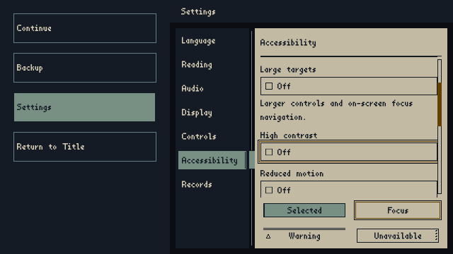

# Bounded Settings visible-keyboard navigation proof

## Outcome and scope

The existing Pause Settings journey now reaches the High Contrast checkbox by
ordinary, separately settled Viewport key events. The actual control and its
complete focus perimeter are visible before activation. Navigation changes
neither Profile contents/revision nor persisted bytes or FileOps count.

Shared SettingsContent remains the focus/scroll owner. No runtime behavior,
save format, recovery fence, History store or output-transaction owner changed.
The only net implementation changes are the existing rendered fixture and three
cloud-generated SaveManager inventory caller coordinates. The complete workflow
is byte-identical to the prior accepted checkpoint.

## Evidence

Source `5959cb7abf30c1cf546e1b0dfa0de372aa7d0b36` is tested as merge
`80a7249203beee5106cdc38bf8bc35a2f2d122cd`, with master parent
`dded76aee2e85aeea94f65218de043b1f4fdce7b`.
[Run 161](https://github.com/Siuuuers/dwm/actions/runs/37220956097), attempt 1,
executes Godot 4.6.3 standard GDScript and PowerShell in GitHub Actions.

All **26 jobs passed**, including all four retained-history comparisons and their
aggregate. This accepts the bounded navigation outcome below, not whole Settings.

The downloaded Settings XML contains **361 cases, zero failures, errors or
skips**. The strict public job reproduces both committed inventories exactly.
Empty and whitespace storage-root negative controls each produce their expected
80 refusals and three storage-free passes, counted separately from primary tests.

The new connected route is Pause Right to Language, five Down inputs to
Accessibility, Right to Font Style, then three Tabs through Text Size and Large
Targets to High Contrast. Each sheet target and its 8-logical-pixel focus
perimeter must fit in the sheet viewport. There is no direct category selection,
target focus grab, manual scroll correction or retry loop along this route.

Before activation, Profile revision remains 3 and FileOps remain 45. The focused
checkbox rectangle is `[736,405,500,52]` in the 1280x720 logical viewport, with
scroll offset 206. Its actual 640x360 PNG shows the complete target and outline.
Following the existing injected marker-cleanup refusal, both uncertainty and
repeated-refusal states retain 64 FileOps and block input/departure. Their PNG
bytes are identical; the factual error copy is readable and has no Retry/Cancel.

Root and an independent reviewer inspected all three diagnostic PNGs. All three
final-run PNGs are byte-identical to those reviewed images. Both reviewers parsed
the final XML, navigation measurements and strict inventory identity. Other jobs
are assessed by workflow job/step results, not a new inspection of every image or
every suite's XML; no new all-suite execution total is claimed.

## Diagnostics and limits

The previous Run157 failure handling remains accepted under its unchanged receipt.
Its pre-action image did not show the focused checkbox. That fixture selected a
sheet and grabbed its fourth control in one frame. Existing visibility tests
settle layout first; the new player-shaped route also settles between inputs.
The passing route closes the bounded visible-target evidence gap. It does not
prove exact callback ordering in the earlier fixture or establish a runtime
navigation defect that required surgery.

Run158 stopped before Settings because three generated `initialize` caller
locations were stale. Run159 had a temporary diagnostic workflow indentation
error before tests; it was corrected. Run160 regenerated inventories in Actions
and passed the focused Settings/public diagnostic. Review verified that only
three caller coordinates changed (160/161/164 to 188/189/192). The final candidate
restored the full original workflow and strict non-regenerating checks.

This is English, 100% text, AfterHours Standard with ordinary targets, real
Profile/Localization/Input and in-memory FileOps. Viewport key events are not
native OS keyboard, UIA, screen-reader speech, production audio-device or
filesystem-outage acceptance. It does not close the full Settings Bead or broaden
live recovery. Existing save/recovery/History guarantees and the approved
software responsibility boundary are unchanged.

## Retained evidence

The receipt records exact source, tested merge, run, archive and retained-file
hashes. This directory retains the Settings XML, three original PNGs, render
measurements/log, both raw negative-control XML reports and source hashes. Original Actions archives expire on 11
October 2026. No historical receipt has been resealed.

