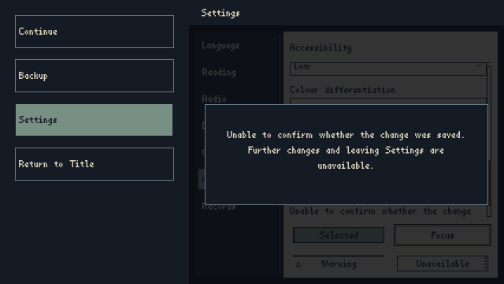

# Bounded Settings write-failure review

## Outcome and owners

An open shared Settings host now distinguishes an ordinary failed write from a write whose durable winner is unknown. Proven uncommitted failure retains the previous value, reports failure and admits a fresh action. Indeterminate failure reports uncertainty and retains foreground custody.

ProfileManager remains the canonical persistence and mutation-fence owner. Shared SettingsContent subscribes to its existing failure signal and immediately removes action admission. Deferred presentation cleanup lets the current SettingsOutputTransactions compensation finish first. Both SettingsApp (Desktop/Pause) and Setting (Title) refuse direct close while uncertain. Existing parent Home/Back/Quick admission remains in place. The existing witnessed recovery panel supplies a no-Retry/no-Cancel presentation; it does not reconcile storage or clear the fatal fence.

No Profile, storage, output-transaction, save-format or History implementation changed. One message was added to each of the five UI catalogs. The canonical catalog-count test is updated from 303 to 304. Generated public inventories contain existing caller-coordinate changes only.

## Failure evidence

Four new real-owner integration cases use JsonFileStorage over deterministic in-memory FileOps, not mocked success/failure results. Audio compensation is checked through FakeAudioPlaybackPort runtime snapshots; it is not a native-device proof:

- Refused profile writes preserve live and persisted data, restore the control, report failure, and allow a successful fresh action.
- Persistent transaction-marker removal refusal leaves new durable bytes with the old live Profile, retains transaction evidence, reports uncertainty and refuses repeated input, departure and Pause Quick admission.
- The actual Title wrapper retains the same uncertainty through Home, Back, direct hide and cached-host reactivation.
- An audio preference transaction preserves physical-output compensation and prior live settings even when candidate Profile bytes won; presentation cleanup neither interrupts rollback nor clears the write fence.

The foreground journey uses actual Pause/Settings hosts, real Profile/Localization/Input owners, injected Godot Viewport key events, and a rendered Windows ANGLE surface. It records the entered host, uncertainty and refusal after repeated input. The pre-action PNG does not display its offscreen focused checkbox, so the rendered proof does not establish visible-target navigation; the integration fixture separately asserts control enclosure before pointer activation. It is not OS-level UIA input, a production audio/native-device test, a filesystem outage or restart-recovery campaign. Existing accepted paused F5/F9 owner evidence is reused.

## Observed result

[Run 157](https://github.com/Siuuuers/dwm/actions/runs/37215097884), attempt 1, completed successfully with all 26 jobs passing. Source `07492163071a6dbe24d881b7c7fe17f7a3236be7` was tested as merge `635e833cb345fa12089f0a3b795ef0d49dd5e6aa`, with unchanged master parent `dded76aee2e85aeea94f65218de043b1f4fdce7b`.

The 13 primary XML reports contain 2,606 executions and 2,602 unique cases, with zero failures, errors or skips. Settings contributes 361 cases, including 12 shared-host cases and four new failure tests. Four intentional phase-diagnostics duplicate executions are preserved. Both expected storage-root refusal controls and the manual witness storage probe pass their separate gates.

Root and the independent reviewer inspected all three Settings PNGs. The error copy is complete and readable, the panel fits within Settings, and no Retry/Cancel appears. Uncertainty and repeated-refusal images are byte-identical, with 64 file operations in both measurements. Only English 100% AfterHours Standard was visually reviewed.

## Review and limits

Independent source/caller/test review completed. The first cloud diagnostics exposed stale inventory/catalog/font expectations and test controls outside their scrolling viewport. Those checks were corrected to current owners; expectations were not disabled. The title direct-hide guard was added after the fixture exposed the distinct Title wrapper. Run 154's cancelled Settings job had no retrievable log, so no cause is assigned to that stall. Run 156 proved all 12 shared-host tests before the old font assertion stopped rendering.

The final candidate restores the complete strict workflow. No diagnostic job exclusions or inventory-regeneration flags remain. Final source, tested merge, XML accounting, artifact hashes and observations are recorded in receipt.json.

This accepts only the demonstrated Settings write-failure field. It does not close all Settings previews, authored sample registration, native speech/display, general live reconciliation or unrelated Beads. There is no forced restart, external-system repair, new recovery manager or live unlock API.

## Retained evidence

[Receipt](receipt.json), [test accounting](test-accounting.json), [raw XML reports](test-reports.zip), [source hashes](source-hashes.json), [render measurements](settings-shared-measurements.json) and [UI literal audit](ui-literal-audit.zip) are retained beside this review.

